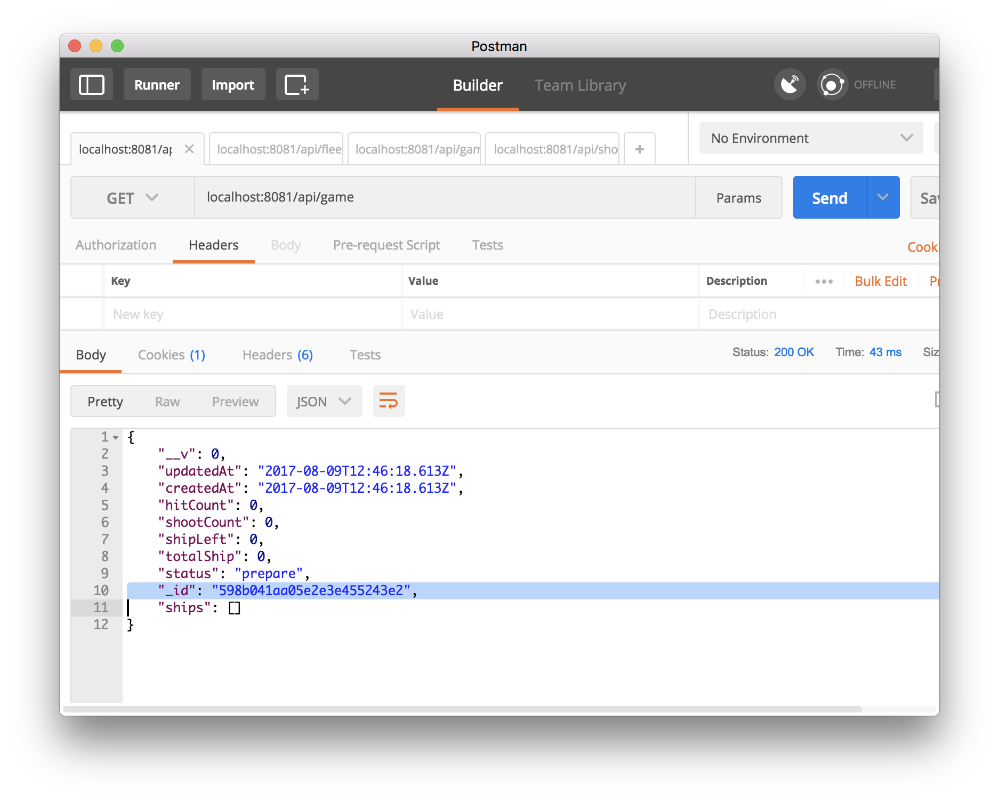
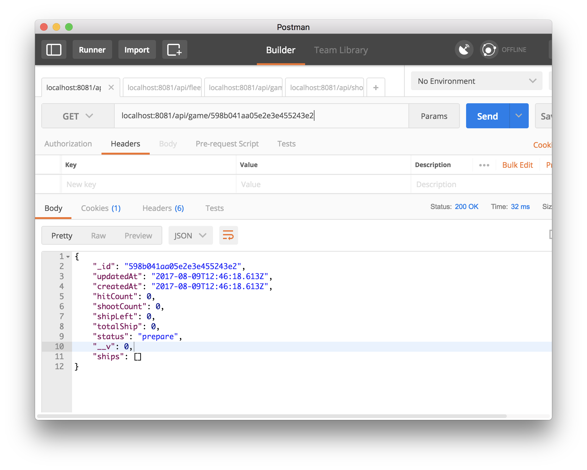
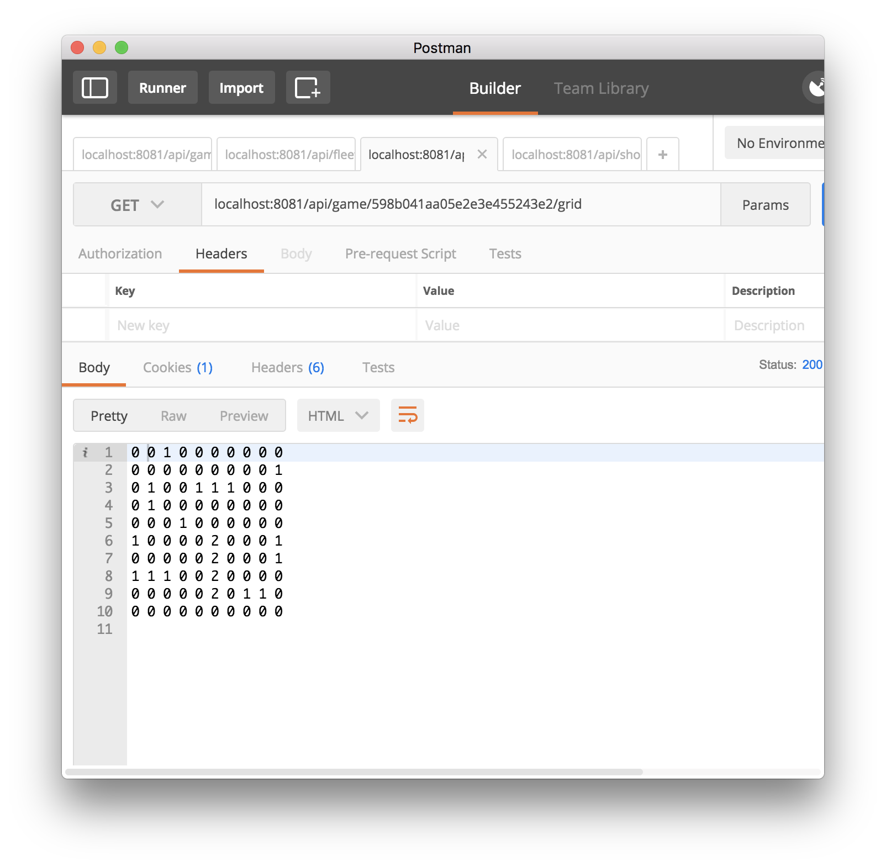
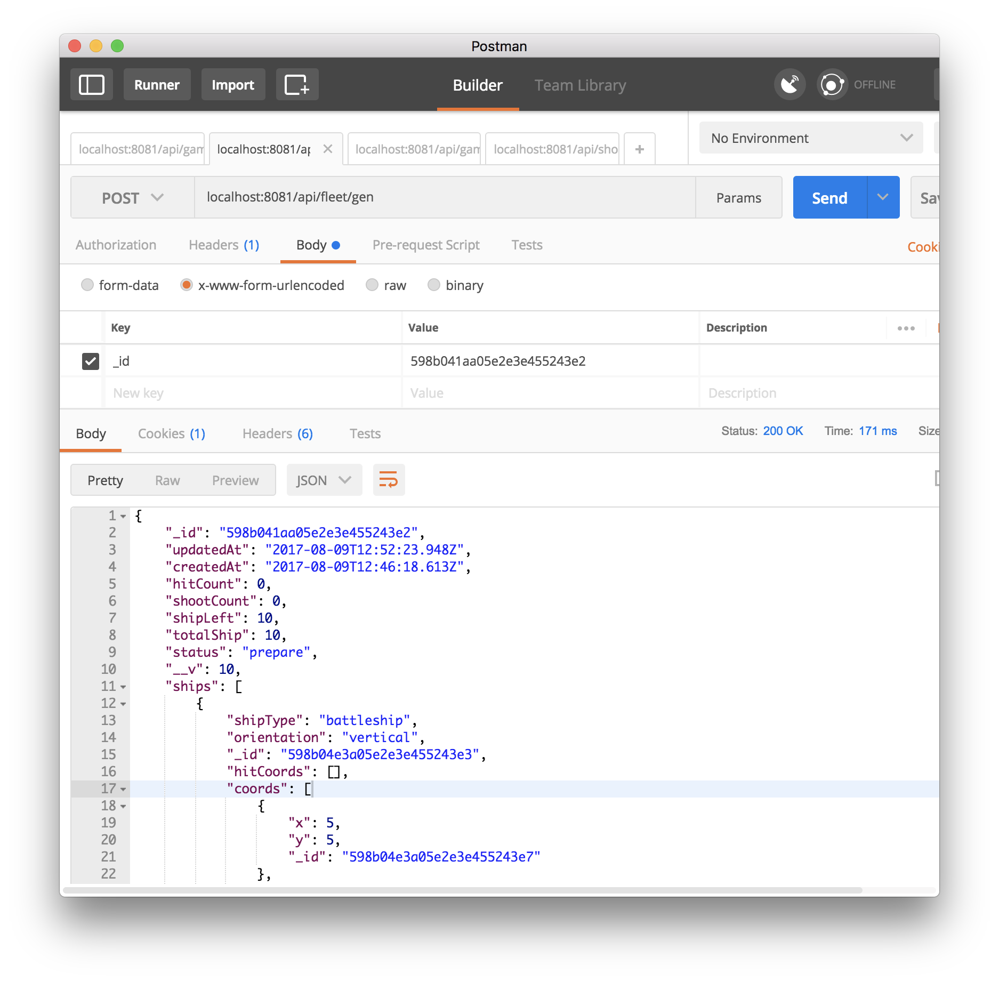
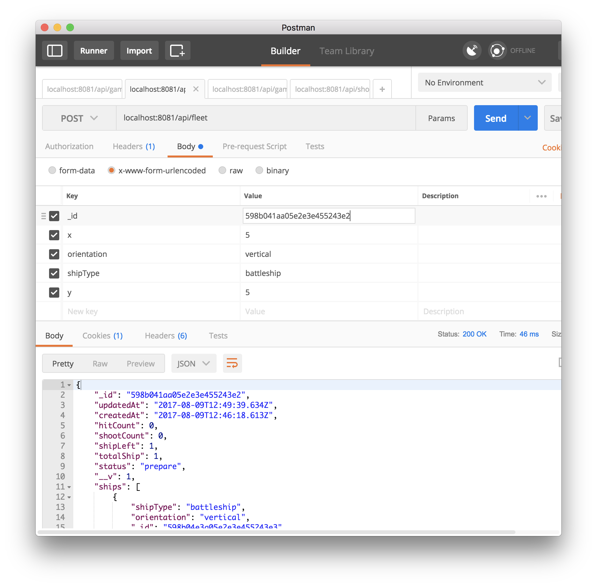
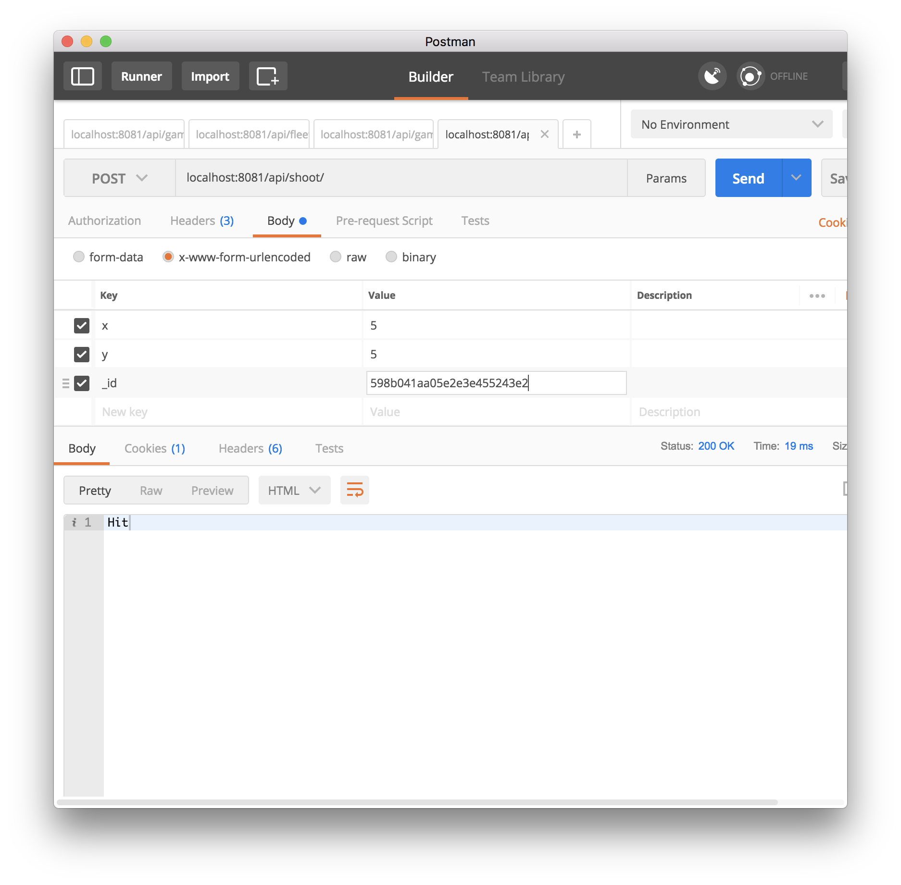
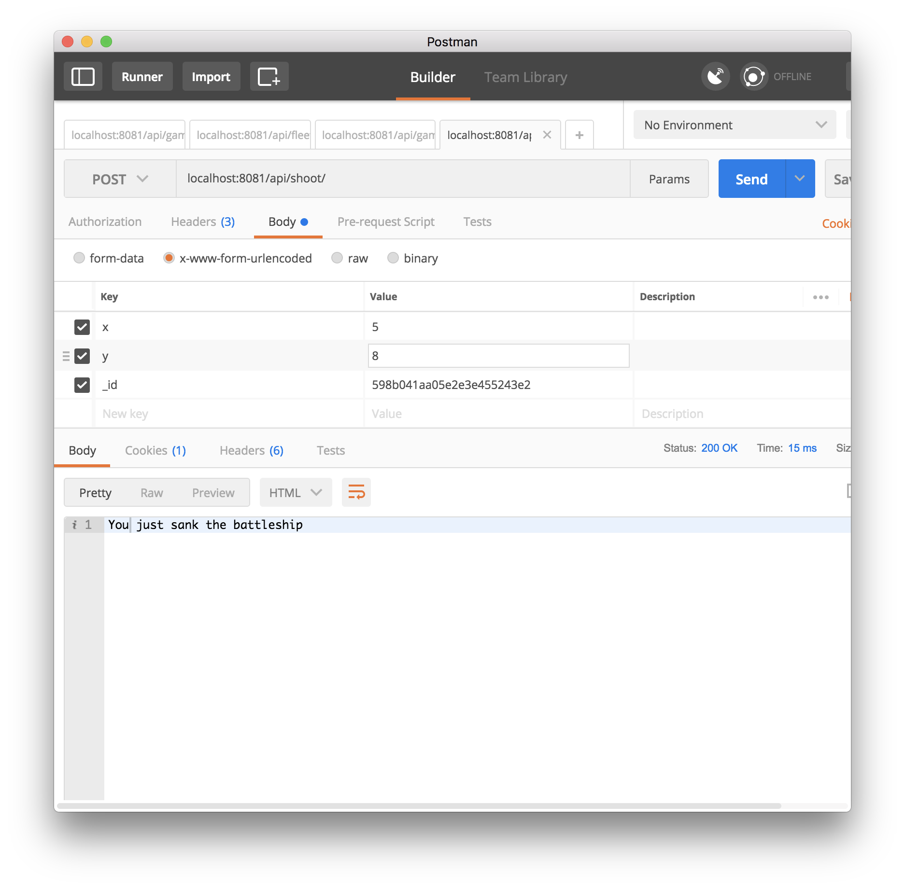
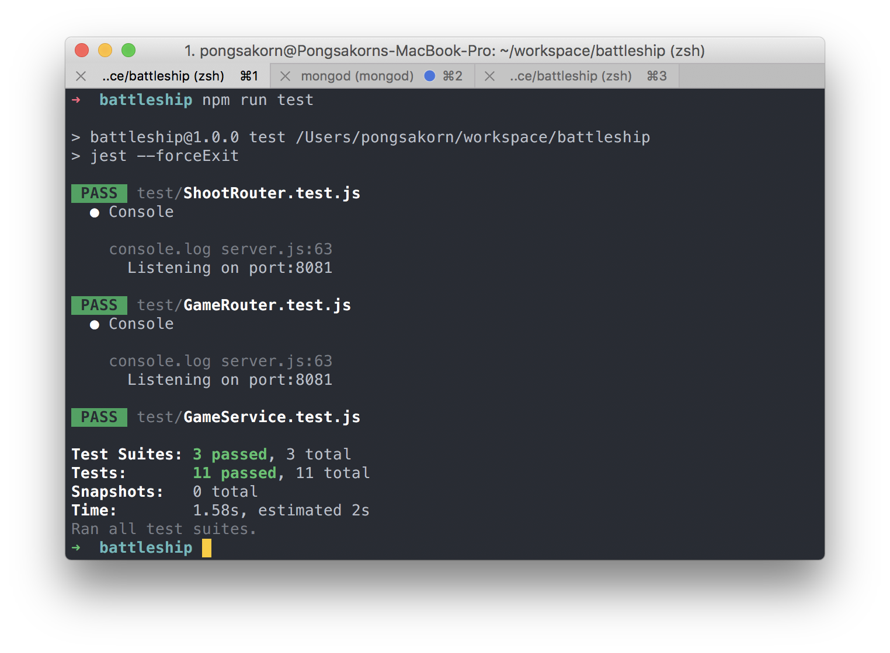

# Battleship

## Start server
`npm run start`
## API
### Game API
`GET /api/game` - create a new game and return game object. Use game `_id` for future reference  

`GET /api/game/:_id` - get game info  

`GET /api/game/:_id/grid` - get current game as grid

### Fleet API

`POST /api/fleet/gen` - automatically generate missing ships and place on board  

__ Data Parameters__  

| Param | Description | required |
|-------|:-----------:|----------|
| (String) _id | game's _id | required |

__ Return __  

| Result | Code | Payload |
|-------|:-----------:|----------|
| Success | 200 | game object |
| Error | 500 | JSON with property `(String)error` |

`POST /api/fleet` - create a new ship and put it to game   

__ Data Parameters__  

| Param | Description | required |
|-------|:-----------:|----------|
| (Number) x | x co-ordinate (0-9)| required |
| (Number) y | y co-ordinate (0-9)| required |
| (String) orientation | either `horizontal` or `vertical`| required |
| (String) shipType | `battleship`, `destroyer`, `cruiser`,`submarine` | required |
| (String) _id | game's _id | required |
__ Return __  

| Result | Code | Payload |
|-------|:-----------:|----------|
| Success | 200 | game object |
| Error | 500 | JSON with property `(String)error` |

### Shooot!!
`POST /api/shoot` - shooooot!!

__ Data Parameters__  

| Param | Description | required |
|-------|:-----------:|----------|
| `(Number) x` | x co-ordinate (0-9)| required |
| `(Number) y` | y co-ordinate (0-9)| required |
| `(String) _id` | game's _id| required |

__ Return __
- __“Miss”__​ when the Attacker​ misses.
- __“Hit”__​ when a ship has been hit but not sunk. Do NOT provide any additional info about what
kind of ship was hit.
- __“You just sank the X”__​ followed by a the ship type. Show this message when the Attacker​ has
successfully sunk a ship.
- __“Win ! You completed the game in X moves (missed Y times)”​__

### Unit Testing
I use [jest](https://facebook.github.io/jest/) to do unit test. [supertest](https://github.com/visionmedia/supertest) to do API router test  

`npm run test`

